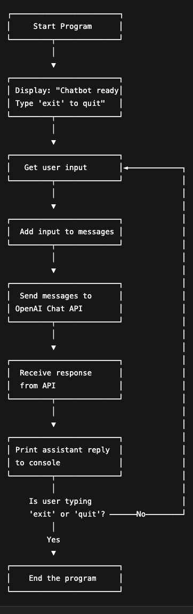

**What it is:**  
This is a simple command-line chatbot built using OpenAI’s GPT-3.5 API.  
It lets users chat with a friendly AI assistant through the terminal.

**Activities & things to try:**
- Ice breaker activity (have a member ask the bot for an activity)
- Modifying the role or content (personality)
- How could we improve this for users? Brainstorm interactively
- Play 20 questions with the bot (think of a word, and have the bot try to guess it)

**How it works:**  

